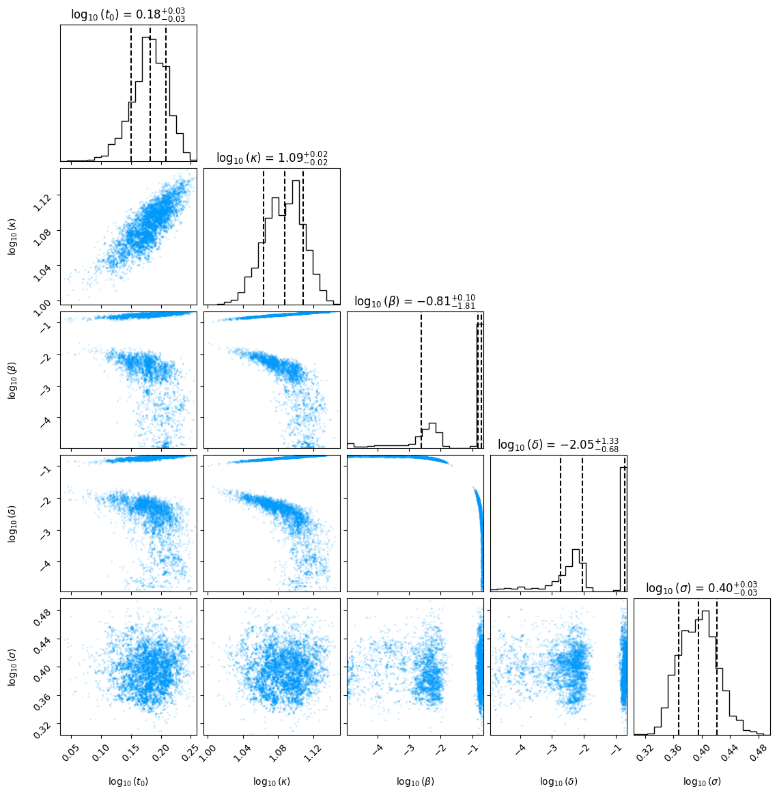

# `nrpt`

[](https://github.com/Estep-Bingham-Lab/nrpt/actions/workflows/CI.yml?query=branch%3Amain)
[](https://codecov.io/gh/Estep-Bingham-Lab/nrpt)

*A JAX-based, NumPyro-compatible implementation of Non-Reversible Parallel Tempering (NRPT)*

**Warning:** `nrpt` is under active development.


## Installation

**Optional**: if you want to run your NumPyro models on an accelerator (GPU/TPU),
make sure to 
[install the correct version of JAX](https://jax.readthedocs.io/en/latest/installation.html)
before proceeding. Otherwise, the following will install the default, CPU-only 
version of JAX.

Using pip
```bash
pip install automcmc @ git+https://github.com/UBC-Stat-ML/automcmc.git
pip install nrpt @ git+https://github.com/Estep-Bingham-Lab/nrpt.git
```

## Example usage

**Note:** In the following we will require the additional packages `pandas` and 
`corner`, which can be installed from common repositories.

To showcase the power of `nrpt`, we will analyze a challenging benchmark problem
described in [Ballnus et al. 2017](https://doi.org/10.1186/s12918-017-0433-1). 
The objective is to estimate the parameters of an Ordinary Differential Equation
(ODE) given noisy observations of its solution. The ODE itself was described in 
[Leonhardt et al. 2014](https://doi.org/10.1016/j.nano.2013.11.008), while the
Bayesian formulation of the inference problem is from 
[Ballnus et al. 2017](https://doi.org/10.1186/s12918-017-0433-1). The latter
shows an empirical comparison of several MCMC samplers on the ODE problem,
indicating that schemes that used Parallel Tempering were the only ones able
to accurately describe the posterior distribution. Indeed, its density is 
bimodal and features narrow ridges.

Here we will show that `nrpt` can leverage an automatically tuned 
sampler described in [Liu et al. (2025)](https://arxiv.org/abs/2410.18929)
to tackle this inference task.
For brevity, we won't go into the details of the model here; be sure to check 
the references if you are curious. We also assume that you are familiar with 
NRPT. Beyond the [original paper](https://doi.org/10.1111/rssb.12464), a good 
reference is the documentation of the Julia package 
[Pigeons.jl](https://pigeons.run/stable/); `nrpt` is heavily inspired by it.

We will aim to reproduce Figure 6 in 
[Ballnus et al. 2017](https://doi.org/10.1186/s12918-017-0433-1), which shows
a corner plot of the posterior samples of the unknown parameters of the ODE.
The model has been written in NumPyro and included in `nrpt`. 
We can load it along all the required dependencies using
```python
from jax import random
from jax import numpy as jnp

from numpyro.diagnostics import print_summary

from automcmc import autohmc

from nrpt import initialization
from nrpt import sampling
from nrpt import toy_examples

import numpy as np

import corner

model, model_args, model_kwargs = toy_examples.mrna()
```
`model` is a python function written using NumPyro primitives. This function
takes as input the observation times -- contained in the tuple `model_args` -- 
and the noisy observations inside the `model_kwargs` dictionary.

Following the NumPyro convention, we enclose the model in an MCMC sampler. In
`nrpt`, this sampler will be used as the *explorer* in the NRPT terminology.
Currently, `nrpt` only works with the MCMC samplers of the 
[`automcmc` package](https://github.com/UBC-Stat-ML/automcmc). For this 
example, we will use the AutoHMC sampler with the default 32 leapfrog steps.
```python
kernel = autohmc.AutoHMC(model)
```

With the explorer in place, we can proceed to instantiate a `PTSampler` object
```python
pt_sampler = initialization.PT(
    kernel, 
    rng_key = random.key(1),
    n_rounds = 14,
    n_replicas = 15,
    n_refresh = 2,
    model_args=model_args, 
    model_kwargs=model_kwargs
)
```
Note that the model arguments are passed to the constructor. There are 
several other settings being provided:

- A JAX PRNG key, used to draw (pseudo-)random variates.
- The number of NRPT rounds is set to 14, so that a total of 
$2^{15}$=16384 samples -- corresponding to the last round -- are returned.
- The number of replicas is set to 15, which is roughly 2.5 times the global
barrier $\Lambda$ of the problem. This is the ideal minimum number of chains
needed for NRPT to correctly bootstrap itself via adaptation. The number of
replicas can be increased past this point until either device memory is 
exhausted or until significant speed deterioration is observed. Of course, 
since $\Lambda$ is a priori unknown, setting `n_replicas` requires some iteration.
- The number of explorer refreshments within each exploration step is set to 2.
This allows us to achieve a worse-case autocorrelation of the log-likelihood 
(across replicas) of less than 0.95.

We can run NRPT typing (takes less than 4 minutes on an Nvidia RTX 2000 Ada
generation laptop GPU)
```python
pt_sampler = sampling.run(pt_sampler)
```
The above will produce an output similar to this
```
  R |        Δt |       ETA |    Λ |      logZ | ρ (mean/max/amax) | newβ₁ | α (min/mean) | AC (mean/max) 
----------------------------------------------------------------------------------------------------------
  1     0:00:13    60:35:01    3.9   -8.56e+02    0.28 / 0.92 / 12   1e-19    0.00 / 0.45    -0.30 / 1.33
  2     0:00:00     0:08:24    3.9   -8.06e+02    0.28 / 0.75 /  2   1e-09    0.34 / 0.58     0.40 / 1.08
  3     0:00:00     0:08:04    6.2   -6.78e+02    0.44 / 0.74 /  9   3e-07    0.25 / 0.54     0.95 / 2.53
  4     0:00:00     0:05:09    6.7   -5.31e+02    0.48 / 0.78 /  5   3e-05    0.34 / 0.61     0.63 / 0.98
  5     0:00:00     0:04:18    6.8   -4.22e+02    0.49 / 0.88 /  5   8e-08    0.60 / 0.77     0.62 / 0.97
  6     0:00:01     0:05:19    5.6   -3.87e+02    0.40 / 0.91 /  2   1e-09    0.50 / 0.81     0.67 / 1.00
  7     0:00:01     0:03:60    5.7   -3.72e+02    0.41 / 0.97 /  4   1e-06    0.46 / 0.82     0.69 / 0.95
  8     0:00:02     0:03:22    6.1   -3.68e+02    0.43 / 0.94 /  4   4e-07    0.55 / 0.81     0.66 / 0.94
  9     0:00:04     0:03:42    6.1   -3.69e+02    0.44 / 0.61 /  6   1e-06    0.55 / 0.86     0.68 / 0.94
 10     0:00:07     0:03:16    6.1   -3.70e+02    0.44 / 0.55 /  6   1e-07    0.57 / 0.87     0.68 / 0.93
 11     0:00:16     0:03:43    6.1   -3.70e+02    0.44 / 0.51 /  1   5e-07    0.52 / 0.85     0.71 / 0.92
 12     0:00:27     0:02:40    6.2   -3.70e+02    0.44 / 0.47 /  9   3e-07    0.57 / 0.87     0.71 / 0.93
 13     0:00:54     0:01:48    6.2   -3.71e+02    0.44 / 0.47 / 10   4e-07    0.58 / 0.87     0.70 / 0.92
 14     0:01:41     0:00:00    6.2   -3.70e+02    0.44 / 0.46 /  4   4e-07    0.66 / 0.87     0.69 / 0.93
```
From left to right, the figures shown here correspond to:

- The round index
- The duration of the round
- The estimated time until sampling is completed. Note that this is very 
inaccurate in the earlier rounds. It begins to stabilize roughly after round 7,
depending on the complexity of the target.
- Estimate of the global barrier, which at the last round is 
$\Lambda \approx 6.2$. 
- Estimate of the log-normalization constant, which in the last round gives
$\log(\mathcal{Z})\approx -370$.
- Average and worst-case swap rejection probabilities. When the average is
close to the maximum -- as in the last 3 rounds -- the ideal *equi-rejection*
condition has been approximately attained.
- The `amax` field in the previous column indicates the chain index that 
shows the highest rejection probability. That is, when
`amax=i`, it means that the swap between chains `i` and `i+1` shows the highest
rejection rate. The next column shows the updated value of the first non-zero 
inverse temperature. This helps with diagnosing high rejection rates for `amax=0`.
- Average and worst-case explorer acceptance probabilities. If the explorer is
working correctly along the path of distributions, we expect both values
to be away from 0 and 1.
- Average and worst-case autocorrelation (AC) of the log-likelihood before and 
after the exploration steps. As described above, the number of refreshments
was set so that the maximum was below 0.95. **Note**: the estimator does not
behave well in small samples, which is why we can see autocorrelation values
larger than one in earlier rounds.

We can now extract the samples and use the `print_summary` function from
NumPyro to show a brief description of the latent values of the model
```python
samples = pt_sampler.pt_state.samples
print_summary(samples, group_by_chain=False)
```
```
                 mean       std    median      5.0%     95.0%     n_eff     r_hat
      lbeta     -1.79      1.07     -2.05     -2.98     -0.66    138.57      1.00
     ldelta     -1.57      1.02     -0.81     -2.75     -0.65    191.20      1.00
       lkm0      1.08      0.02      1.08      1.05      1.12    126.16      1.02
  log_joint   -321.94     61.61   -358.13   -362.92   -218.77  13799.25      1.00
    log_lik   -349.63      1.73   -349.32   -352.09   -347.00    284.18      1.00
  log_prior     -7.70      0.56     -7.53     -8.12     -7.37    238.94      1.00
     lsigma      0.40      0.02      0.39      0.35      0.43    239.19      1.00
        lt0      0.18      0.03      0.18      0.13      0.23    142.11      1.02
```
The summary includes the model parameters as well as the log prior, log likelihood,
and log joint---corresponding to log posterior plus the log density
of the momentum. For all these quantities, we see effective sample sizes (`n_eff`)
of over 100, together with $\hat R$ diagnostics close to 1. This indicates
successfull exploration of the posterior distribution.

Finally, we can recreate the corner plot in Ballnus et al. (2017) using
```python
transformed_samples = np.array(jnp.vstack(
    [
        samples['lt0'],
        samples['lkm0'],
        samples['lbeta'],
        samples['ldelta'],
        samples['lsigma']
    ]
).swapaxes(0,1))
figure = corner.corner(
    transformed_samples,
    labels=[
        r"$\log_{10}(t_0)$",
        r"$\log_{10}(\kappa)$",
        r"$\log_{10}(\beta)$",
        r"$\log_{10}(\delta)$",
        r"$\log_{10}(\sigma)$",
    ],
    quantiles=[0.16, 0.5, 0.84],
    show_titles=True,
    title_kwargs={"fontsize": 12},
    plot_contours=False,
    smooth=False,
    plot_density=False,
    data_kwargs={'color': (0.0,0.6056031611752245,0.9786801175696073)}
)
figure.savefig('mrna_corner.png', bbox_inches='tight')
```


Note that the posterior is clearly bimodal. Not only that, the shapes
of these two modes are completely different. Moreover, there is a clear
ridge visible in the $(\log_{10}(\beta),\log_{10}(\delta))$ plot. These 
features make this problem extremely hard to tackle using traditional 
MCMC algorithms.


## References

Syed, S., Bouchard-Côté, A., Deligiannidis, G., & Doucet, A. (2022). 
[Non-reversible parallel tempering: a scalable highly parallel MCMC scheme](https://doi.org/10.1111/rssb.12464). 
*Journal of the Royal Statistical Society Series B: Statistical Methodology*, 84(2), 321-350.

Liu, T., Surjanovic, N., Biron-Lattes, M., Bouchard-Côté, A., & Campbell, T. (2024).
[AutoStep: Locally adaptive involutive MCMC](https://arxiv.org/abs/2410.18929). 
*arXiv preprint arXiv:2410.18929*. Accepted to ICML 2025.


## TODO

- Documentation
