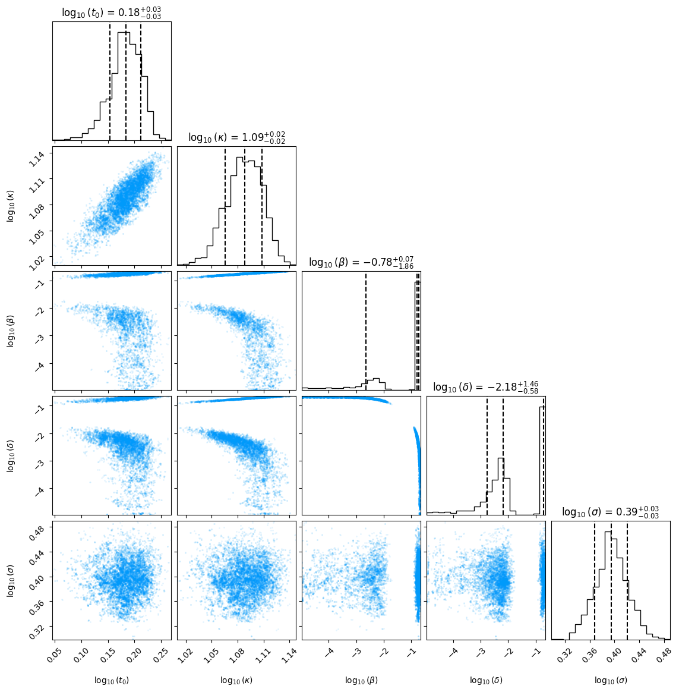

# `nrpt`

[](https://github.com/Estep-Bingham-Lab/nrpt/actions/workflows/CI.yml?query=branch%3Amain)
[](https://codecov.io/gh/Estep-Bingham-Lab/nrpt)

*A JAX-based, NumPyro-compatible implementation of Non-Reversible Parallel Tempering (NRPT)*

**Warning:** `nrpt` is under active development.


## Installation

**Optional**: if you want to run your NumPyro models on an accelerator (GPU/TPU),
make sure to 
[install the correct version of JAX](https://jax.readthedocs.io/en/latest/installation.html).
Otherwise, the following will install the default, CPU-only version of JAX.

Using pip
```bash
pip install nrpt @ git+https://github.com/Estep-Bingham-Lab/nrpt.git
```

## Example usage

**Note:** In the following we will require the additional packages `pandas` and 
`corner`, which can be installed from common repositories.

To showcase the power of `nrpt`, we will analyze a challenging benchmark problem
described in [Ballnus et al. 2017](https://doi.org/10.1186/s12918-017-0433-1). 
The objective is to estimate the parameters of an Ordinary Differential Equation
(ODE) given noisy observations of its solution. The ODE itself was described in 
[Leonhardt et al. 2014](https://doi.org/10.1016/j.nano.2013.11.008), while the
Bayesian formulation of the inference problem is from 
[Ballnus et al. 2017](https://doi.org/10.1186/s12918-017-0433-1). For brevity,
we won't go into the details of the model here; be sure to check the references
if you are curious. We also assume that you are familiar with NRPT. Beyond
the [original paper](https://doi.org/10.1111/rssb.12464), a good reference 
is the documentation of the Julia package 
[Pigeons.jl](https://pigeons.run/stable/); `nrpt` is heavily inspired by it.

We will aim to reproduce Figure 6 in 
[Ballnus et al. 2017](https://doi.org/10.1186/s12918-017-0433-1), which shows
a corner plot of the posterior samples of the unknown parameters of the ODE.
The model has been written in NumPyro and included in `nrpt`. We can load it along all the required dependencies using
```python
from jax import random
from jax import numpy as jnp

from autostep import autorwmh

from nrpt import initialization
from nrpt import sampling
from nrpt import toy_examples

import numpy as np

import corner

import time

model, model_args, model_kwargs = toy_examples.mrna()
```
`model` is a python function written using NumPyro primitives. This function
takes as input the observation times -- contained in the tuple `model_args` -- 
and the noisy observations inside the `model_kwargs` dictionary.

Following the NumPyro convention, we enclose the model in an MCMC sampler. In
`nrpt`, this sampler will be used as the *explorer* in the NRPT terminology.
Currently, `nrpt` only works with the MCMC samplers of the 
[`autostep` package](https://github.com/UBC-Stat-ML/autostep), which is
automatically installed along `nrpt`. For this example, we will use the
AutoRWMH (auto random-walk Metropolis-Hastings) sampler.
```python
kernel = autorwmh.AutoRWMH(model)
```

With the explorer in place, we can proceed to instantiate a `PT` object
```python
pt_sampler = initialization.PT(
    kernel, 
    rng_key = random.key(1),
    n_rounds = 14,
    n_replicas = 15,
    n_refresh = 32,
    model_args=model_args, 
    model_kwargs=model_kwargs
)
```
Note that the model arguments are passed to the constructor. There are 
several other settings being provided:

- A JAX PRNG key, used to draw (pseudo-)random variates.
- The number of NRPT rounds is set to 14, so that a total of 
$2^{14}$=16384 samples are returned.
- The number of replicas is set to 15, which is roughly 2.5 times the global
barrier of the problem.
- The number of explorer refreshments within each exploration step is set to 32.
This allows us to achieve a worse-case autocorrelation of the log-likelihood 
(across replicas) of less than 0.95.

Finally, we can run the process using
```python
start_time = time.time()
pt_sampler = sampling.run(pt_sampler)
print(f"--- {time.time() - start_time} seconds ---")
```
The above will produce an output similar to this
```
 Round |     Λ |      logZ | ρ (mean/max) | α (min/mean) | llAC (mean/max) 
---------------------------------------------------------------------------
     1     3.5   -8.60e+02        0.2/1.0        0.4/0.7       0.62 / 8.45
     2     4.6   -8.35e+02        0.3/0.9        0.5/0.7       0.73 / 2.01
     3     5.9   -7.43e+02        0.4/0.8        0.3/0.5       0.80 / 1.44
     4     6.0   -6.51e+02        0.4/0.8        0.3/0.4       0.75 / 0.96
     5     7.8   -5.52e+02        0.6/0.9        0.3/0.4       0.69 / 1.00
     6     7.6   -5.33e+02        0.5/1.0        0.3/0.4       0.68 / 1.00
     7     7.9   -5.09e+02        0.6/0.9        0.4/0.5       0.74 / 1.00
     8     7.1   -4.37e+02        0.5/0.7        0.3/0.4       0.76 / 1.00
     9     6.3   -3.79e+02        0.5/0.9        0.3/0.4       0.71 / 0.98
    10     6.0   -3.70e+02        0.4/0.6        0.3/0.4       0.64 / 0.92
    11     6.0   -3.69e+02        0.4/0.6        0.4/0.5       0.61 / 0.95
    12     6.2   -3.71e+02        0.4/0.5        0.4/0.4       0.63 / 0.94
    13     6.2   -3.71e+02        0.4/0.5        0.3/0.4       0.62 / 0.93
    14     6.2   -3.71e+02        0.4/0.5        0.4/0.4       0.62 / 0.93
--- 776.9151175022125 seconds ---
```
The figures shown here correspond to

- Estimates of the global barrier, which at the last round is 
$\Lambda \approx 6.2$. 
- Estimates of the log-normalization constant, which in the last round gives
$\log(\mathcal{Z})\approx -371$.
- Average and worst-case swap rejection probabilities. When the average is
close to the maximum -- as in the last rounds -- the ideal *equi-rejection*
condition has been approximately attained.
- Average and worst-case explorer acceptance probabilities. If the explorer is
working correctly along the path of distributions, we expect both values
to be away from 0 and 1.
- Average and worst-case autocorrelation of the log-likelihood before and 
after the exploration steps. As described above, the number of refreshments
was set so that the maximum was below 0.95.

We can now extract the samples and create the corner plot using
```python
samples = pt_sampler.pt_state.samples
transformed_samples = np.array(jnp.vstack(
    [
        samples['lt0'],
        samples['lkm0'],
        samples['lbeta'],
        samples['ldelta'],
        samples['lsigma']
    ]
).swapaxes(0,1))
figure = corner.corner(
    transformed_samples,
    labels=[
        r"$\log_{10}(t_0)$",
        r"$\log_{10}(\kappa)$",
        r"$\log_{10}(\beta)$",
        r"$\log_{10}(\delta)$",
        r"$\log_{10}(\sigma)$",
    ],
    quantiles=[0.16, 0.5, 0.84],
    show_titles=True,
    title_kwargs={"fontsize": 12},
    plot_contours=False,
    smooth=False,
    plot_density=False,
    data_kwargs={'color': (0.0,0.6056031611752245,0.9786801175696073)}
)
figure.savefig('mrna_corner.png', bbox_inches='tight')
```


Note that the posterior is clearly bimodal. Not only that, the shapes
of these two modes are completely different. These features make this
problem extremely hard to tackle using traditional MCMC algorithms.


## References

Syed, S., Bouchard-Côté, A., Deligiannidis, G., & Doucet, A. (2022). 
[Non-reversible parallel tempering: a scalable highly parallel MCMC scheme](https://doi.org/10.1111/rssb.12464). 
*Journal of the Royal Statistical Society Series B: Statistical Methodology*, 84(2), 321-350.

Liu, T., Surjanovic, N., Biron-Lattes, M., Bouchard-Côté, A., & Campbell, T. (2024).
AutoStep: Locally adaptive involutive MCMC. *arXiv preprint arXiv:2410.18929*.
Accepted to ICML 2025.


## TODO

- Measure time elapsed in round 

